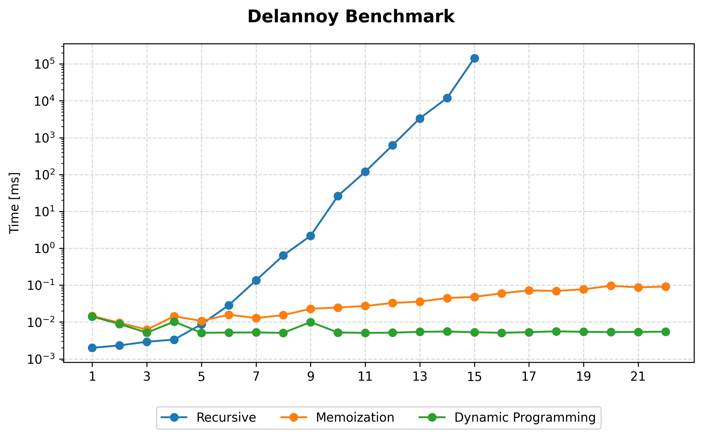

# Sheet 11

## Task A

#### Theoretical Improvement

$O(D_{rec}(n)) = \sum_{k = 0}^{n} \binom{n}{k}^2 \cdot 2^k$

$O(D_{mem}(n)) = n^2$

#### Practical Improvement

#### Space Complexity

$Space(D(x,y)_{mem}) = x \cdot y$

## Task B