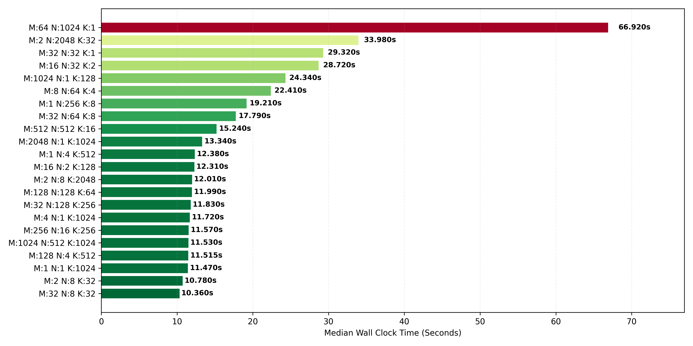
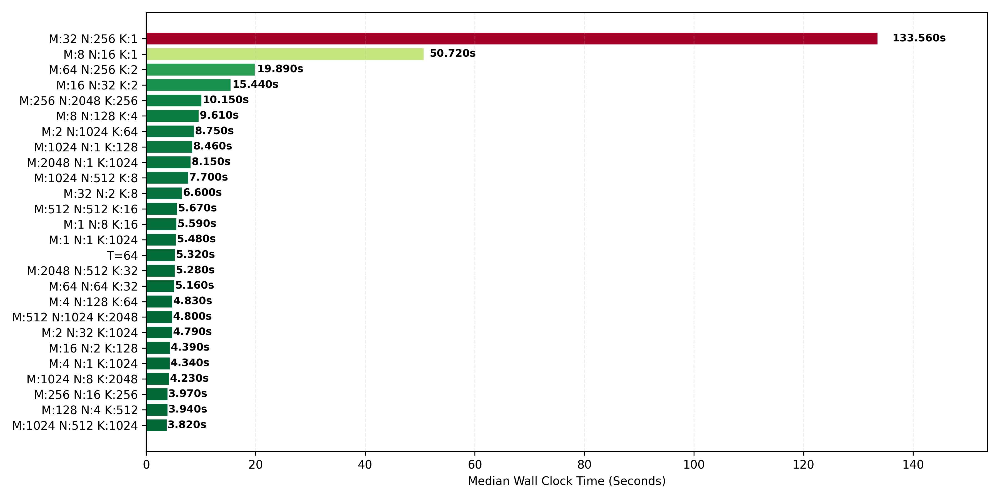
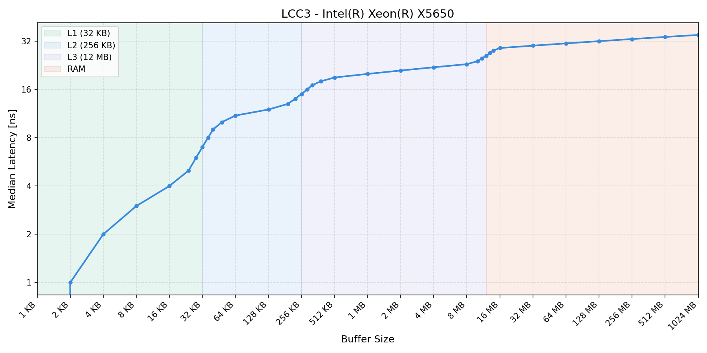
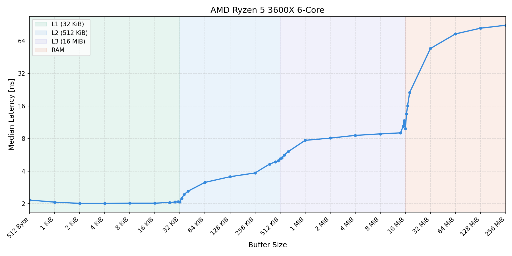

# Sheet 06

## Task A

### Change Main Loop Order

At first change the loop order from:

```c
for (int i = 0; i < N; i++)
	{
		for (int j = 0; j < K; j++)
		{
			TYPE sum = 0;
			for (int k = 0; k < M; k++)
			{
				sum += A[i][k] * B[k][j];
			}
			C[i][j] = sum;
		}
	}
```

to:

```c
for (int m = 0; m < M; ++m)
{
	for (int n = 0; n < N; ++n)
	{
		for (int k = 0; k < K; ++k)
		{
 			C[m][k] += A[m][n] * B[n][k];
		}
	}
}
```

This improves access pattern e.g. spatial reuse distance.

### Loop Tiling

Tile across all loops:

```c
for (int m_tile = 0; m_tile < M; m_tile += M_T)
	{
		for (int n_tile = 0; n_tile < N; n_tile += N_T)
		{
			for (int k_tile = 0; k_tile < K; k_tile += K_T)
			{
				for (int m = m_tile; m < MIN(M, m_tile + M_T); ++m)
				{
					for (int n = n_tile; n < MIN(N, n_tile + N_T); ++n)
					{
						for (int k = k_tile; k < MIN(K, k_tile + K_T); ++k)
						{
							C[m][k] += A[m][n] * B[n][k];
						}
					}
				}
			}
		}
	}
```

This improves temporal usage distance.

### Results

The benchmark script uses **Optima** to sample from space $\{2^i \mid 0 \leq i \le 12 \}^3$

#### LCC3



#### Local



From the results it seems clear to avoid small values for $K$

## Task B

The Benchmark allocates a buffer of a given size in KB. This buffer contains $n$ elements of the struct: 

```c
typedef struct node
{
  struct node *next;
} node;
```

Another buffer of $n$ Integers is created and filled with the numbers 0 to $n - 1$. The buffer is then shuffeld according to [Fisher-Yates](https://en.wikipedia.org/wiki/Fisher%E2%80%93Yates_shuffle) shuffle. 

The node-buffer is transformed into a linked list where the following element of a node is determined by the integer-buffer:

```c
for (size_t i = 0; i < num_elements - 1; ++i)
  {
    buffer[perm[i]].next = &buffer[perm[i + 1]];
  }
  buffer[perm[num_elements - 1]].next = &buffer[perm[0]];
```

This results in a circle within the node-buffer that covers all nodes.

This is neccessary to avoid the cpu from recognizing access patterns and prefetching any elements.

## Task C

### LCC3



### Local

